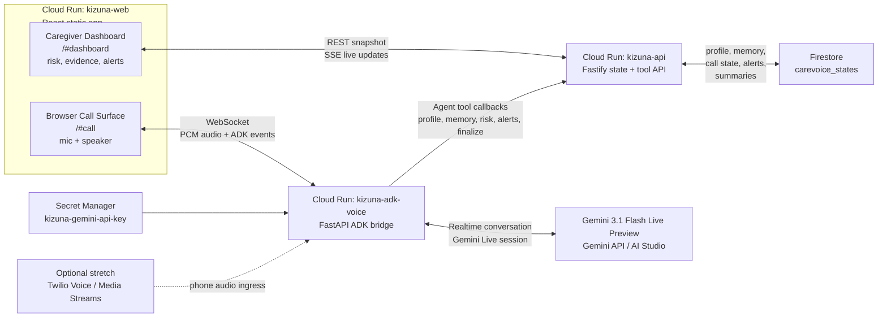

# CareVoice

CareVoice is a Gemini-powered welfare-check voice platform for elderly people living alone in Japan.

The product goal is a memory-enabled Japanese voice agent that checks in naturally, understands risk in realtime, and updates a caregiver dashboard with evidence-backed alerts and summaries.

## Current Status

Implemented:

- React caregiver dashboard and browser call surface.
- Fastify API for state, scenario bootstrap, ADK tool callbacks, and SSE updates.
- Shared Zod/TypeScript contracts.
- Firestore-backed deployed state with in-memory local fallback.
- Fallback local evaluator for development only.
- Agent adapter boundary with fallback and Gemini modes.
- ADK voice bridge to Gemini 3.1 Flash Live Preview through the Gemini API / AI Studio key.
- Agent tool endpoints for profile, memory, risk state, alerts, and summaries.
- Realtime agent-managed risk decisions, evidence-backed alerts, memory updates, and call finalization.
- Caregiver briefing foundation.
- Cloud Run deployment for web, API, and ADK voice services.

Not yet implemented:

- Production phone-call ingress. Browser voice is the primary demo path; Twilio Voice / Media Streams remains an optional stretch path.

## Live Demo

- Web app: <https://kizuna-web-ox3726wewq-an.a.run.app>
- Dashboard: <https://kizuna-web-ox3726wewq-an.a.run.app/#dashboard>
- Call surface: <https://kizuna-web-ox3726wewq-an.a.run.app/#call>

## Final Architecture



Core runtime path:

1. The elder uses the browser call surface for the hackathon demo.
2. The ADK voice service streams the conversation to Gemini Live.
3. Gemini controls the conversation and calls tools for profile, memory, risk, alerts, and finalization.
4. The API persists state in Firestore and pushes live dashboard updates over SSE.
5. The caregiver dashboard shows the working platform: transcript, reasoning state, risk evidence, memory context, alerts, and post-call handoff.

## Documentation

Start here:

- [Documentation map](./docs/README.md)
- [Product requirements](./docs/01-product-requirements.md)
- [Architecture](./docs/02-architecture.md)
- [Implementation plan](./docs/03-implementation-plan.md)
- [Gemini agent setup](./docs/04-gemini-agent-setup.md)
- [Contracts](./docs/05-contracts.md)
- [Demo script](./docs/06-demo-script.md)
- [Deployment](./docs/07-deployment.md)
- [Task dependency hierarchy](./docs/08-task-dependency-hierarchy.md)
- [Browser voice plan](./docs/09-browser-voice-plan.md)

Archived earlier planning artifact:

- [Gemini hackathon plan HTML](./docs/archive/gemini-hackathon-plan.html)

## Local Development

Install dependencies:

```bash
npm install
```

Run the API:

```bash
npm run dev:api
```

Run the dashboard:

```bash
npm run dev:web
```

Default local URLs:

```text
API: http://localhost:8080
Web: http://localhost:5173
```

Validate:

```bash
npm test
npm run typecheck
npm run build
```

## Positioning

CareVoice is a well-being and welfare-check companion, not an AI doctor, diagnosis assistant, or emergency service replacement.
